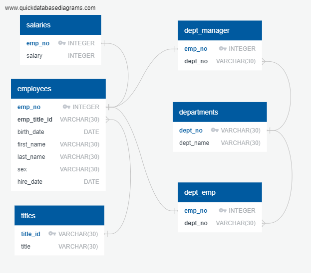

# Employee Database with SQL

## Summary
This project engineers and analyses data on a fictitious company's employees from the 1980s and 1990s. All that remains of the database are six CSV files. The data was imported into a SQL database. Then the database was queried for analysis. 

## Tools
PostgreSQL 
[Quick Database Diagrams](http://www.quickdatabasediagrams.com)

# Process
## Data Engineering
1. Reviewed the CSVs provided and created an ERD, or entity relationship diagram.

2. Created tables in pgAdmin with the [EmployeeSQL/Analysis/tableschemata.sql](EmployeeSQL/Analysis/tableschemata.sql). While importing one CSV file at a time to fill these tables with data.

## Data Analysis

3. Queried database to find relevant employee information. See [EmployeeSQL/Analysis/QuestionSchemas.sql](EmployeeSQL/Analysis/QuestionSchemas.sql) for analysis.
 
 
# Contact Information
### Hope Neely 
Email: [hope.neely@gmail.com](hope.neely@gmail.com) 
LinkedIn: [https://www.linkedin.com/in/hopeneely/](https://www.linkedin.com/in/hopeneely/)